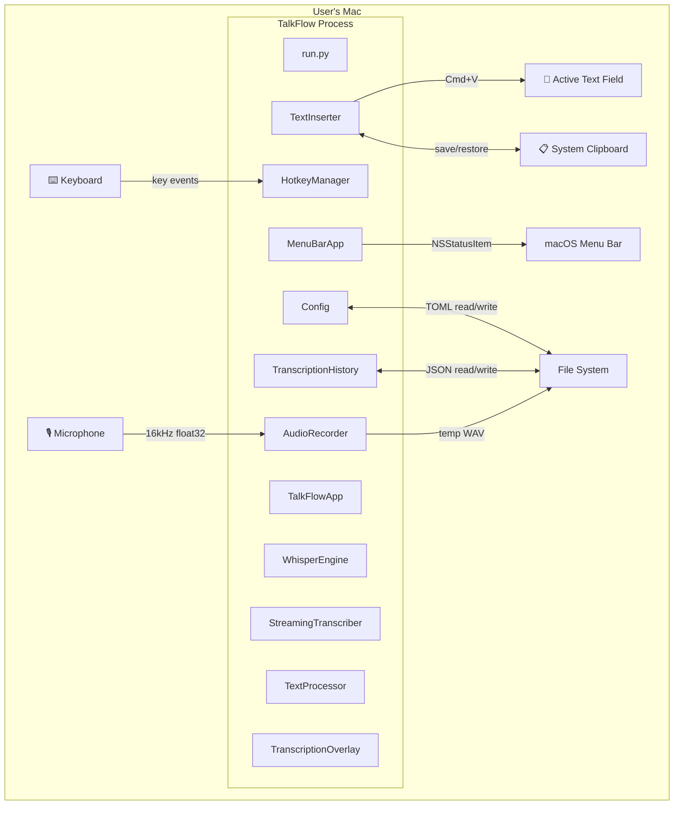
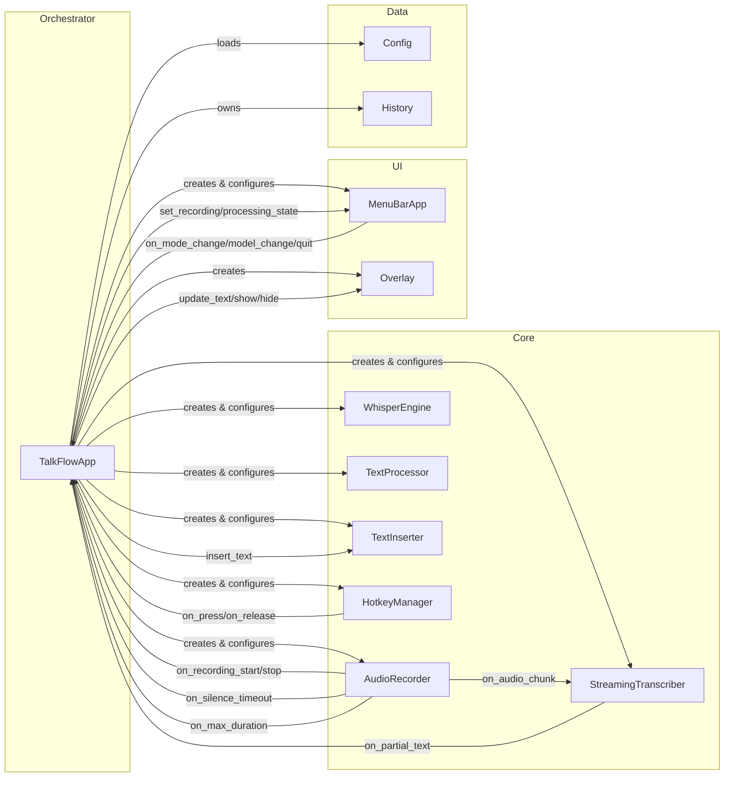
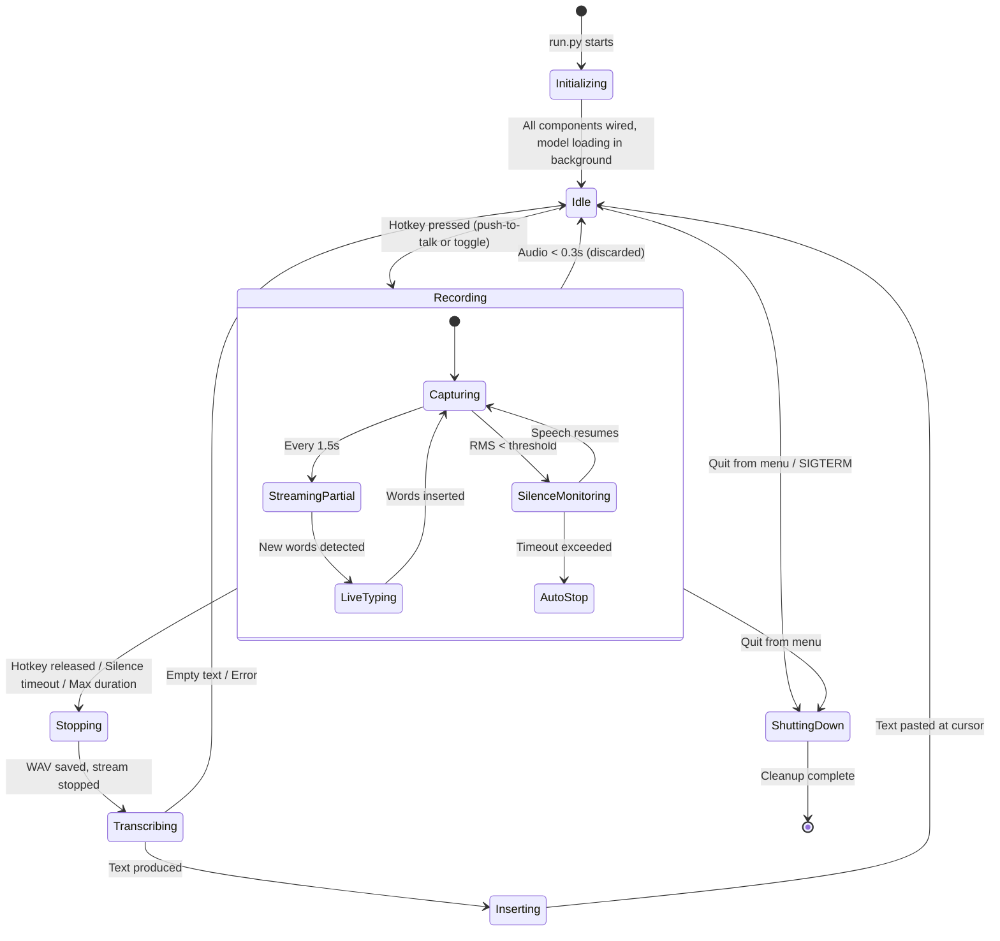
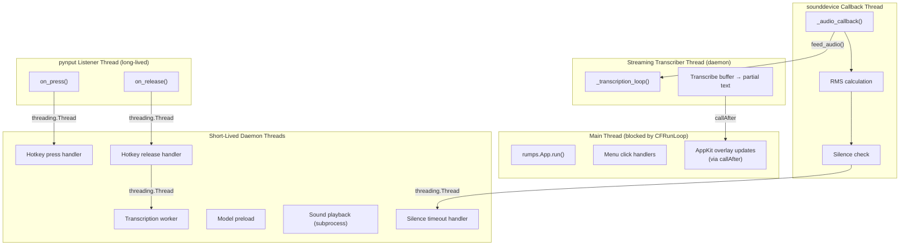
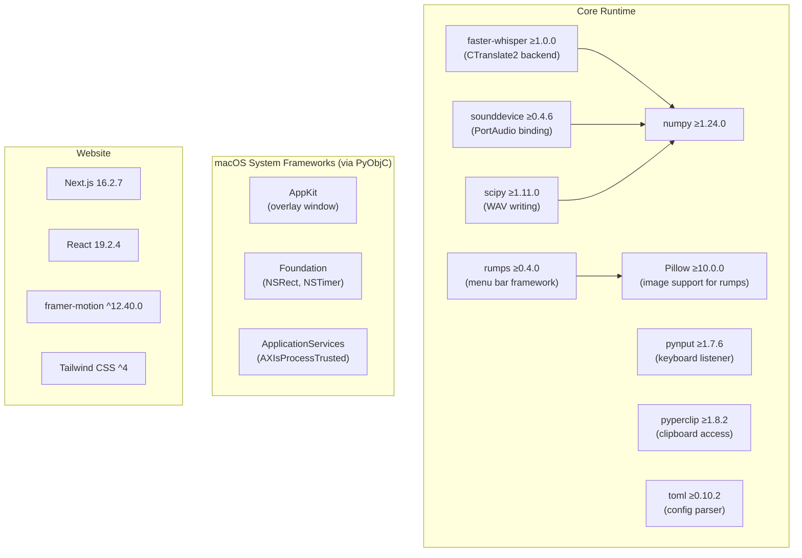

# Deep Codebase Mastery & Documentation — Specification

## Purpose

This spec is your structured path to **fully owning** the TalkFlow codebase — an AI-built macOS voice-to-text tool. By the end, you'll understand every decision, every data path, every weakness, and be able to confidently modify, debug, or rewrite any part.

---

## Part 1: Requirements (What You Need to Understand)

### R1 — Big Picture Mental Model

| ID | Learning Objective |
|----|-------------------|
| R1.1 | Understand what TalkFlow does from a user's perspective (the "one sentence" pitch) |
| R1.2 | Know the 3 core phases: Capture → Transcribe → Insert |
| R1.3 | Understand why "100% local" matters (privacy, latency, offline use) |
| R1.4 | Know the dual-mode operation: push-to-talk vs. toggle |
| R1.5 | Understand the streaming vs. final-pass duality (partial live typing + accuracy pass) |
| R1.6 | Know all external dependencies and why each was chosen over alternatives |

### R2 — Entry Points & Lifecycle

| ID | Learning Objective |
|----|-------------------|
| R2.1 | Trace the startup path from `run.py` → `main()` → `TalkFlowApp.run()` |
| R2.2 | Understand what happens on the main thread vs. background threads |
| R2.3 | Know the shutdown sequence and what cleanup occurs |
| R2.4 | Understand PID file management and why it exists |
| R2.5 | Know how the shell scripts (start/stop/install) interact with the Python process |

### R3 — Component Architecture

| ID | Learning Objective |
|----|-------------------|
| R3.1 | Map every class to its single responsibility |
| R3.2 | Understand the callback wiring pattern (who calls whom and when) |
| R3.3 | Know which components are stateful vs. stateless |
| R3.4 | Understand the dependency graph (what requires what to function) |
| R3.5 | Identify which components could be swapped out independently |

### R4 — Data Flow & Transformation

| ID | Learning Objective |
|----|-------------------|
| R4.1 | Trace audio data from microphone → numpy array → WAV file → Whisper → text string |
| R4.2 | Understand the text transformation pipeline: raw → commands → punctuation → spacing → final |
| R4.3 | Know how clipboard content flows: save → overwrite → paste → delay → restore |
| R4.4 | Trace configuration data: TOML file → dataclass → runtime use → save back |
| R4.5 | Understand history data flow: transcription → entry → JSON file → menu bar re-paste |

### R5 — Concurrency & Threading

| ID | Learning Objective |
|----|-------------------|
| R5.1 | Enumerate every thread type and its lifecycle |
| R5.2 | Identify all shared mutable state and its protection mechanisms |
| R5.3 | Understand the race conditions that were addressed (and those that weren't) |
| R5.4 | Know why the main thread must run rumps/CFRunLoop and what would break if it didn't |
| R5.5 | Understand why hotkey callbacks spawn new threads instead of running inline |

### R6 — macOS Integration Points

| ID | Learning Objective |
|----|-------------------|
| R6.1 | Know the 3 required macOS permissions and what each enables |
| R6.2 | Understand how pynput accesses the keyboard (IOKit/HID events) |
| R6.3 | Understand how rumps integrates with the macOS menu bar (NSStatusItem) |
| R6.4 | Know how AppKit overlay window is created and managed from Python |
| R6.5 | Understand the Launch Agent / launchd auto-start mechanism |

### R7 — Error Handling & Edge Cases

| ID | Learning Objective |
|----|-------------------|
| R7.1 | Know every failure mode and how/whether it's handled |
| R7.2 | Understand the 120s transcription timeout mechanism |
| R7.3 | Know what happens when permissions are missing |
| R7.4 | Understand the "too short" audio discard logic |
| R7.5 | Know what happens if the Whisper model isn't loaded when recording starts |

### R8 — Website Architecture

| ID | Learning Objective |
|----|-------------------|
| R8.1 | Understand the Next.js App Router structure |
| R8.2 | Know how Tailwind v4 + CSS variables enable the theme system |
| R8.3 | Understand client components vs. server components in this project |
| R8.4 | Know the animation strategy (Framer Motion patterns used) |

### R9 — Quality & Maintainability Gaps

| ID | Learning Objective |
|----|-------------------|
| R9.1 | Identify all missing tests and what should be tested |
| R9.2 | Find all hardcoded values that should be configurable |
| R9.3 | Identify dead code and compatibility stubs |
| R9.4 | Know the logging gaps and propose a solution |
| R9.5 | Find the security/privacy boundaries and verify they hold |

---

## Part 2: Technical Design Document

### D1 — System Context Diagram



### D2 — Component Relationship Map



### D3 — State Machine (Application Lifecycle)



### D4 — Threading Architecture



### D5 — Data Transformation Pipeline

```mermaid
graph LR
    subgraph Input
        A["🎤 Analog audio"]
    end

    subgraph Capture["AudioRecorder"]
        B["float32 numpy chunks<br/>16kHz mono"]
        C["np.concatenate → full array"]
        D["× 32767 → int16"]
        E["scipy.write_wav → /tmp/*.wav"]
    end

    subgraph Transcribe["WhisperEngine"]
        F["faster-whisper model.transcribe()"]
        G["Generator of Segment objects"]
        H["Join segment.text → raw string"]
    end

    subgraph Process["TextProcessor"]
        I["_apply_capitalization()<br/>'all caps hello' → 'HELLO'"]
        J["_apply_formatting()<br/>'new line' → \\n"]
        K["_apply_punctuation()<br/>'period' → ."]
        L["_clean_spacing()<br/>doubles, caps after .!?"]
    end

    subgraph Insert["TextInserter"]
        M["pyperclip.copy(text)"]
        N["pynput Cmd+V"]
        O["350ms sleep"]
        P["pyperclip.copy(old)"]
    end

    A --> B --> C --> D --> E --> F --> G --> H --> I --> J --> K --> L --> M --> N --> O --> P
```



### D6 — File-by-File Purpose Map

| File | Lines | Purpose | Key Classes/Functions |
|------|-------|---------|----------------------|
| `run.py` | ~30 | Entry point: PID file, path setup, debug env, call main() | `_write_pid_file()`, `_remove_pid_file()` |
| `src/main.py` | ~350 | Orchestrator: wires components, manages state, handles all callbacks | `TalkFlowApp`, `TranscriptionHistory`, `main()` |
| `src/core/audio_recorder.py` | ~250 | Records audio, monitors levels, detects silence, manages stream lifecycle | `AudioRecorder` |
| `src/core/whisper_engine.py` | ~150 | Loads Whisper model, transcribes with timeout, manages model lifecycle | `WhisperEngine`, `TranscriptionResult` |
| `src/core/streaming_transcriber.py` | ~150 | Periodic buffer transcription for live typing | `StreamingTranscriber` |
| `src/core/text_processor.py` | ~180 | Spoken command → punctuation/formatting replacement | `TextProcessor` |
| `src/core/text_inserter.py` | ~80 | Clipboard-based text paste with save/restore | `TextInserter` |
| `src/core/hotkey_manager.py` | ~250 | Global keyboard listener with key normalization | `HotkeyManager` |
| `src/ui/menu_bar.py` | ~170 | macOS menu bar app with state display and menu actions | `MenuBarApp` |
| `src/ui/overlay.py` | ~150 | Floating AppKit window for live transcription display | `TranscriptionOverlay` |
| `src/utils/config.py` | ~170 | TOML config with dataclass models and auto-migration | `Config`, `AudioConfig`, `WhisperConfig`, etc. |
| `config/settings.toml` | ~30 | Default configuration template (reference, not runtime) | — |
| `scripts/install.sh` | ~130 | venv creation, pip install, package verification, permission check | — |
| `scripts/start.sh` | ~60 | Background launch with PID management | — |
| `scripts/stop.sh` | ~35 | Process kill with fallback | — |
| `scripts/autostart.sh` | ~80 | Launch Agent plist install/uninstall | — |
| `scripts/check_permissions.py` | ~300 | Host app detection, permission verification, interactive setup | `detect_host_app()`, `check_accessibility()` |
| `test_record.py` | ~60 | Manual integration test (records 10s, transcribes) | — |
| `website/src/app/page.tsx` | ~20 | Landing page composition (imports all sections) | `Home()` |
| `website/src/app/layout.tsx` | ~25 | Root layout with Inter font and metadata | `RootLayout()` |
| `website/src/app/globals.css` | ~150 | CSS variables, glass morphism, blobs, animations | — |
| `website/src/components/*.tsx` | ~600 total | 8 React components for landing page sections | Various |

### D7 — Dependency Graph (External Libraries)



### D8 — Configuration Hierarchy

```
Priority (highest wins):
  1. Runtime changes via menu bar (model, mode) — not persisted until quit
  2. ~/.config/talkflow/config.toml (user config, auto-created)
  3. Dataclass defaults in src/utils/config.py (hardcoded fallbacks)
  4. config/settings.toml (reference template, never read at runtime)
```

Note: `config/settings.toml` in the repo is **documentation only**. The app reads from `~/.config/talkflow/config.toml`. If that file doesn't exist, dataclass defaults are used and then written there.

---

## Part 3: Implementation / Task List (Learning Plan)

This is your ordered study plan. Each task builds on the previous. Follow this sequence for maximum comprehension.

---

### Phase 1: Foundation (Understand the skeleton)

#### Task 1.1 — Read `run.py` (5 min)
**File:** `run.py`  
**Goal:** Understand the absolute entry point.  
**What to observe:**
- PID file write + atexit cleanup
- `sys.path` manipulation to make `src/` importable
- `TALKFLOW_DEBUG` environment variable defaulting to "1"
- How `from main import main` works (relative to the path manipulation)

**Verify:** Can you explain why `sys.path.insert(0, str(src_path))` is needed instead of a proper package install?

---

#### Task 1.2 — Read `src/utils/config.py` (15 min)
**File:** `src/utils/config.py`  
**Goal:** Understand the configuration system that drives everything else.  
**What to observe:**
- 5 nested `@dataclass` classes with typed defaults
- `Config.load()` classmethod: TOML parsing → dataclass instantiation
- Auto-migration logic (deprecated hotkeys, forced English, forced clipboard)
- `get_config_path()` pointing to `~/.config/talkflow/config.toml`
- `get_default_config_content()` — generates the documented template

**Verify:** What happens if a user has an old config with `backend = "mlx"`? (Answer: the `whisper_fields` filtering drops unknown keys silently)

---

#### Task 1.3 — Read `src/core/__init__.py` and `src/ui/__init__.py` (2 min)
**Files:** Package init files  
**Goal:** See which classes are "public API" of each subpackage.  
**Observation:** `StreamingTranscriber` is NOT exported from core — it's imported directly in `main.py`. This tells you it was added later.

---

### Phase 2: The Recording Path (Microphone → WAV)

#### Task 2.1 — Read `src/core/audio_recorder.py` (25 min)
**File:** `src/core/audio_recorder.py`  
**Goal:** Master the audio capture system.  
**Study these aspects in order:**
1. Constructor: note `_state_lock` vs `_chunks_lock` (separate concerns)
2. `start_recording()`: the `_starting` flag prevents double-start
3. `_audio_callback()`: this runs on sounddevice's audio thread — note it's minimal work
4. `_check_silence()`: the `_has_had_speech` guard is the clever bit
5. `stop_recording()`: concatenation, minimum length check, float32→int16 conversion
6. `_on_max_duration()`: Timer-based safety net

**Verify:** Why does `_check_silence` fire `on_silence_timeout` on a separate thread? (Answer: the audio callback thread must never block — any blocking would cause audio buffer overrun)

---

#### Task 2.2 — Understand the audio format chain (5 min)
**Trace:**
```
sounddevice → float32, 16000 Hz, mono, shape (N, 1)
  → stored in list of numpy arrays
  → np.concatenate → single array
  → × 32767 → int16 (PCM)
  → scipy.io.wavfile.write → /tmp/talkflow_XXXXX.wav
```

**Verify:** Why float32 → int16? (Answer: faster-whisper expects standard PCM WAV. float32 WAV is non-standard and may not be parsed correctly by all backends)

---

### Phase 3: Transcription (WAV → Text)

#### Task 3.1 — Read `src/core/whisper_engine.py` (20 min)
**File:** `src/core/whisper_engine.py`  
**Study in order:**
1. `TranscriptionResult` dataclass — the output contract
2. `_get_device_and_compute()` — auto-detection logic
3. `load_model()` — lazy loading with guard
4. `transcribe()` — the timeout wrapper using ThreadPoolExecutor
5. `_transcribe_impl()` — the actual Whisper call with all kwargs explained
6. The `use_vad = audio_duration > 30.0` decision

**Key kwargs to understand:**
- `beam_size=1` — greedy decoding (fast, slightly less accurate)
- `condition_on_previous_text=False` — prevents hallucination loops
- `temperature=0.0` — deterministic output
- `no_speech_threshold=0.6` — how "no speech" is detected

**Verify:** What would happen if you removed the 120s timeout? (Answer: Silero VAD + certain audio patterns can cause faster-whisper to loop indefinitely)

---

#### Task 3.2 — Read `src/core/streaming_transcriber.py` (15 min)
**File:** `src/core/streaming_transcriber.py`  
**Goal:** Understand the live typing mechanism.  
**Key insight:** This runs a SEPARATE transcription every 1.5s on the accumulated buffer. It's not "streaming ASR" — it's repeated batch transcription on growing audio.

**Study:**
1. `_transcription_loop()` — sleep-based polling (not event-driven)
2. `_transcribe_buffer()` — writes temp WAV, runs model, cleans up
3. `_get_model()` — currently reuses the main engine's model (`use_fast_model=False`)
4. `feed_audio()` — just appends to buffer (lock-protected)

**Verify:** Why is this approach potentially problematic? (Answer: Whisper re-transcribes the ENTIRE buffer each time — it may produce different text for previously-transcribed sections, causing "revision" artifacts)

---

### Phase 4: Text Processing & Insertion

#### Task 4.1 — Read `src/core/text_processor.py` (15 min)
**File:** `src/core/text_processor.py`  
**Study:**
1. `PUNCTUATION_MAP` — 30+ spoken words mapped to characters
2. `_command_pattern` regex — built dynamically, longest-first matching
3. Processing order matters: capitalization → formatting → punctuation → spacing
4. `_clean_spacing()` — the auto-capitalization after sentence endings

**Verify:** What happens if someone says "the period of time"? (Answer: "period" gets replaced with "." → "the. of time". This is the fundamental false-positive problem with spoken command processing)

---

#### Task 4.2 — Read `src/core/text_inserter.py` (10 min)
**File:** `src/core/text_inserter.py`  
**Observe:**
- `_insert_via_clipboard()` is the ONLY real method — everything else is a stub
- The 50ms sleep before Cmd+V (lets clipboard propagate)
- The 350ms sleep before clipboard restore (lets paste complete in rich editors)
- `set_typing_mode()` and `set_typing_delay()` do nothing (dead code)

**Verify:** Why was direct typing removed? (Answer: pynput's `Controller.type()` doesn't work in many Electron/web-based editors — Slack, Notion, VS Code — because they use custom input handling that ignores synthetic key events)

---

### Phase 5: Input & Control

#### Task 5.1 — Read `src/core/hotkey_manager.py` (20 min)
**File:** `src/core/hotkey_manager.py`  
**Study in order:**
1. `_normalize_key()` — the key canonicalization strategy
2. `_on_press()` / `_on_release()` — state tracking with `_current_keys` set
3. `_check_hotkey_match()` — subset check (not equality — extra keys are OK)
4. Why press/release callbacks spawn threads (`threading.Thread(target=..., daemon=True)`)
5. `parse_hotkey_string()` — string → Key set conversion
6. `format_hotkey_label()` — user-facing display

**Verify:** Why does `_check_hotkey_match` use `issubset` instead of `==`? (Answer: allows the hotkey to work even if the user has other keys held. E.g., Ctrl+. works even if Shift is also down)

---

### Phase 6: User Interface

#### Task 6.1 — Read `src/ui/menu_bar.py` (15 min)
**File:** `src/ui/menu_bar.py`  
**Study:**
- `rumps.App` subclass with dynamic `self.title` (emoji icons)
- `_build_menu()` — creates the menu hierarchy programmatically
- State methods that the orchestrator calls
- Lambda callbacks with `m=model` closure capture trick

**Verify:** Why is `quit_button=None` passed to super()? (Answer: to prevent rumps from adding its own Quit button — we create a custom one with our cleanup callback)

---

#### Task 6.2 — Read `src/ui/overlay.py` (15 min)
**File:** `src/ui/overlay.py`  
**Study:**
- Pure AppKit/PyObjC window creation
- `NSVisualEffectMaterialHUDWindow` — the macOS blur material
- `setIgnoresMouseEvents_(True)` — click-through
- `setCollectionBehavior_` flags — appears on all Spaces
- `_perform_on_main()` — thread safety via `AppHelper.callAfter`

**Verify:** What would happen if `update_text()` is called from a background thread without `_perform_on_main`? (Answer: AppKit is not thread-safe — you'd get crashes or visual corruption)

---

### Phase 7: The Orchestrator

#### Task 7.1 — Read `src/main.py` (30 min — the most important file)
**File:** `src/main.py`  
**Study in order:**
1. `TranscriptionHistory` — simple JSON persistence with lock
2. `TalkFlowApp.__init__()` — all component creation and wiring
3. `_setup_callbacks()` — the callback registration that makes everything work
4. `_on_hotkey_press()` / `_on_hotkey_release()` — the control flow entry points
5. `_on_partial_transcription()` — live typing with `_live_typed_text` tracking
6. `_transcribe_and_insert()` — final pass with delta calculation
7. `_on_recording_start()` / `_on_recording_stop()` — state transitions + overlay/sound
8. `run()` — startup banner, listener start, model preload, menu bar launch

**Critical understanding:** The `_live_typed_text` tracking is the most fragile part. It assumes text only grows (never revises). When Whisper revises, the delta calculation produces wrong results.

---

### Phase 8: Scripts & Operations

#### Task 8.1 — Read all shell scripts (15 min)
**Files:** `scripts/install.sh`, `start.sh`, `stop.sh`, `autostart.sh`  
**Observe:**
- `install.sh`: progress bars, per-package install loop, verification step
- `start.sh`: DYLD_LIBRARY_PATH fix for Homebrew Python expat issue
- `stop.sh`: PID-based kill + fallback `pgrep` with cwd matching
- `autostart.sh`: plist generation with heredoc

**Verify:** Why does `start.sh` set `DYLD_LIBRARY_PATH`? (Answer: Homebrew Python on macOS can have a broken expat linkage that crashes the process. This workaround points to the Homebrew-installed expat library)

---

#### Task 8.2 — Read `scripts/check_permissions.py` (20 min)
**File:** `scripts/check_permissions.py`  
**This is the most complex script.** Study:
1. `detect_from_environment()` — reads TERM_PROGRAM, VSCODE_PID env vars
2. `detect_from_process_tree()` — walks up parent PIDs via `ps` command
3. `check_accessibility()` — calls macOS `AXIsProcessTrusted()` API
4. `check_input_monitoring()` — tries to start a pynput listener (fails if no permission)
5. Interactive setup flow with `input()` prompts and `open` commands

---

### Phase 9: Website

#### Task 9.1 — Read website structure (15 min)
**Files:** `website/src/app/page.tsx`, `layout.tsx`, `globals.css`  
**Study:**
- App Router structure (page.tsx = route, layout.tsx = wrapper)
- CSS variable system for theming (`--background`, `--foreground`, etc.)
- `globals.css` custom animations: `gradient-shift`, `blob-morph`, `marquee`

---

#### Task 9.2 — Read key components (20 min)
**Files:** `hero.tsx`, `live-demo.tsx`, `theme-toggle.tsx`  
**Study:**
- `LiveDemo` — typewriter effect using `useState` + `useEffect` + `setTimeout`
- `ThemeToggle` — localStorage + `document.documentElement.classList.toggle`
- `Hero` — Framer Motion staggered entrance animations

---

### Phase 10: Quality Verification & Improvement Opportunities

#### Task 10.1 — Audit for bugs and issues
**Checklist:**
- [ ] Confirm clipboard restore works when user pastes nothing (empty clipboard)
- [ ] Check if overlay `_hide_timer` logic actually works (NSTimer selector is a no-op lambda)
- [ ] Verify `_live_typed_text` handles text revision gracefully
- [ ] Check if concurrent model access is possible between streaming and final pass
- [ ] Look for temp file cleanup on process crash/restart

---

#### Task 10.2 — Refactoring suggestions (prioritized)

| Priority | Refactoring | Why |
|----------|-------------|-----|
| High | Add a proper logging framework (stdlib `logging`) | Replace 20+ `print(f"[debug]...")` calls |
| High | Add startup temp file cleanup (`/tmp/talkflow_*`) | Prevents disk space leak on crashes |
| High | Fix overlay hide timer (currently broken NSTimer usage) | Timer selector is a no-op |
| Medium | Extract `_live_typed_text` logic into StreamingTranscriber | Reduces orchestrator complexity |
| Medium | Add unit tests for TextProcessor | Most testable component, highest value |
| Medium | Add integration test for Config load/save round-trip | Prevents migration regressions |
| Low | Remove dead code (set_typing_mode, set_typing_delay) | Clean API surface |
| Low | Centralize debug flag reading | Currently checked independently in 5 files |
| Low | Type-annotate all callbacks with Protocol classes | Better IDE support |

---

#### Task 10.3 — Security review checklist
- [ ] pynput Listener receives ALL key events but only processes hotkey — verified ✓
- [ ] Audio temp files deleted in `finally` block — verified ✓ (but not on crash)
- [ ] No network calls anywhere in the Python codebase — verified ✓
- [ ] Config file permissions (readable only by owner) — NOT enforced ⚠️
- [ ] History file may contain sensitive dictated content — no encryption ⚠️
- [ ] subprocess calls use lists (not shell=True) — verified ✓

---

## Summary: Your Study Order

```
Day 1 (Foundation):     run.py → config.py → __init__.py files
Day 2 (Audio):          audio_recorder.py (+ understand numpy/scipy/sounddevice)
Day 3 (Transcription):  whisper_engine.py → streaming_transcriber.py
Day 4 (Processing):     text_processor.py → text_inserter.py
Day 5 (Control):        hotkey_manager.py
Day 6 (UI):             menu_bar.py → overlay.py
Day 7 (Orchestrator):   main.py (the big one — connects everything)
Day 8 (Operations):     All shell scripts + check_permissions.py
Day 9 (Website):        Next.js structure + key components
Day 10 (Quality):       Audit checklist + refactoring plan
```

Each day: **read the file, answer the "Verify" questions, then explain the component to yourself out loud.** If you can teach it, you own it.
