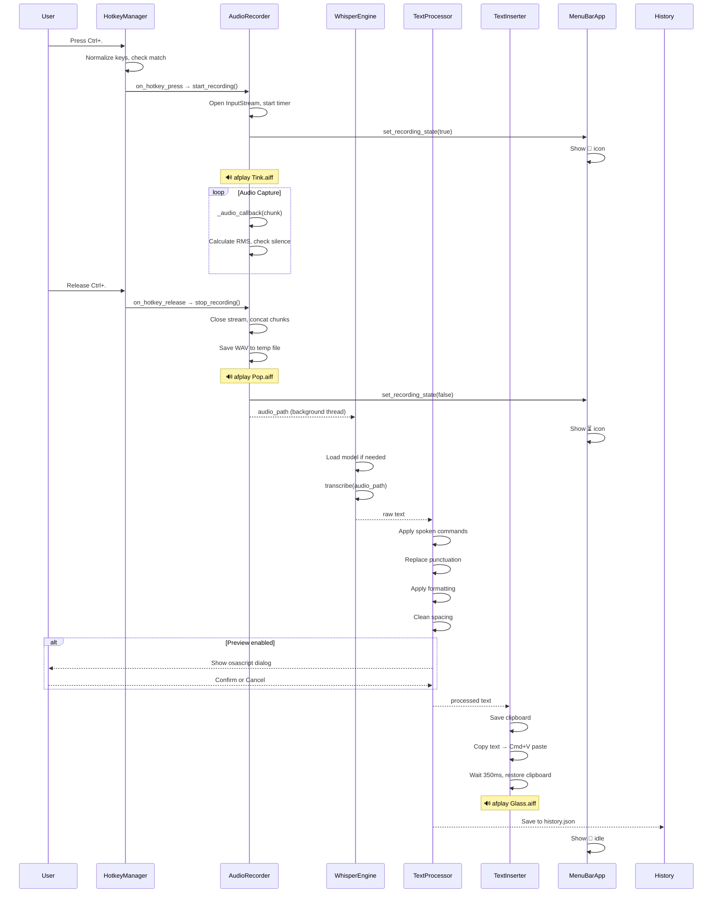
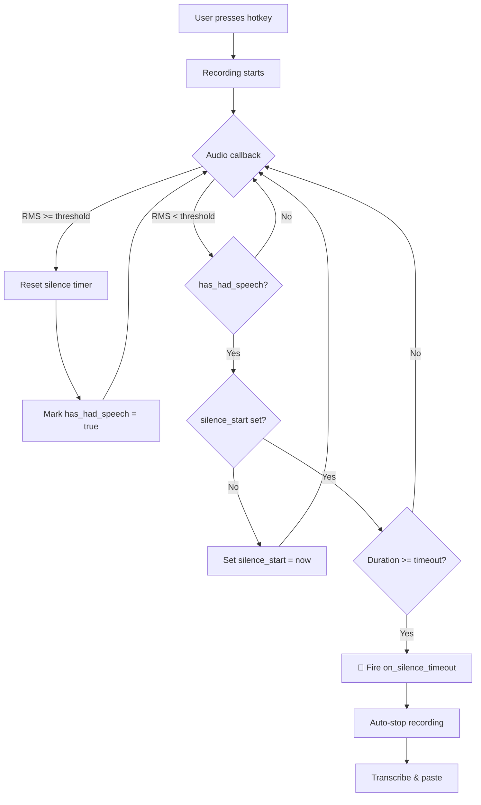
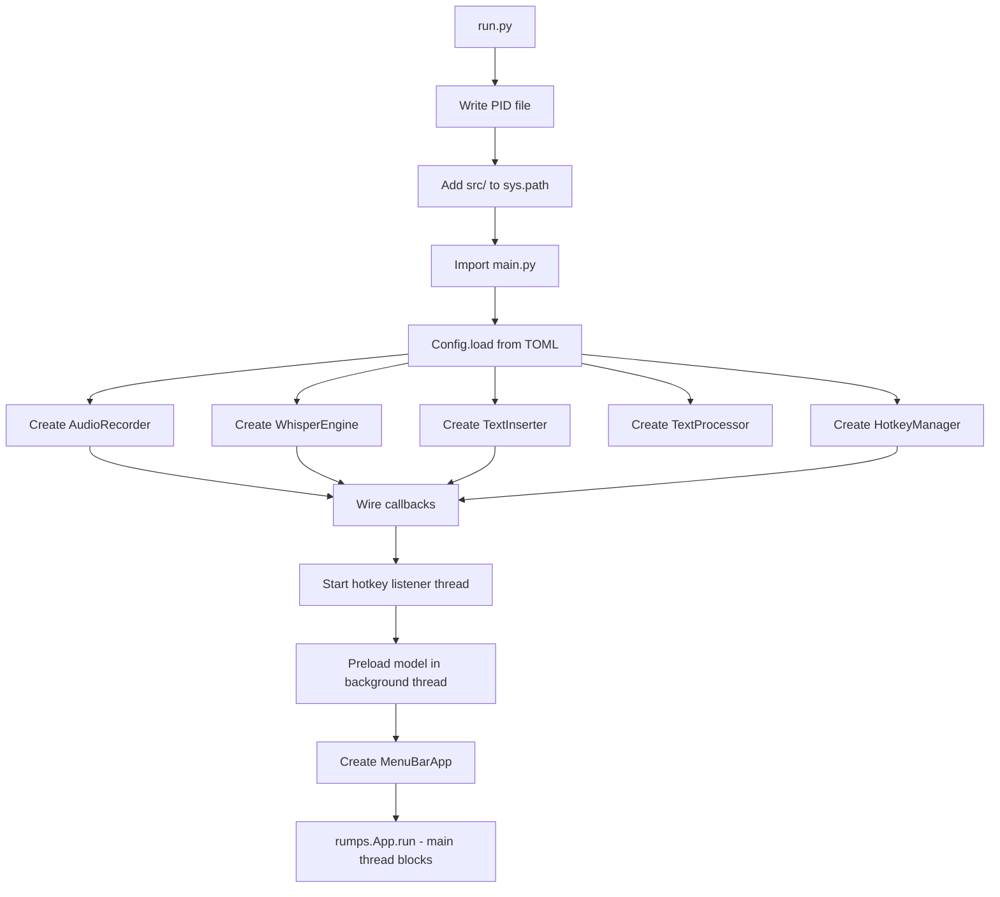
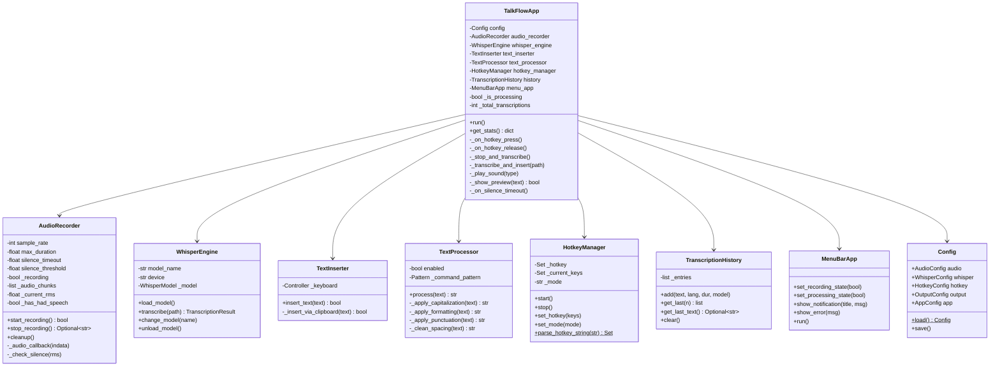
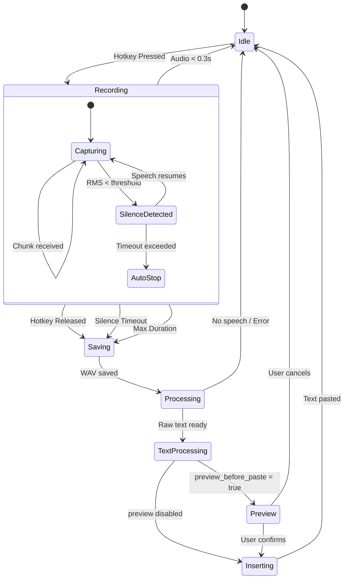
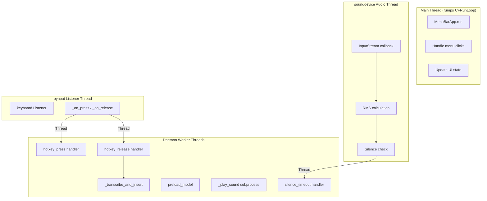
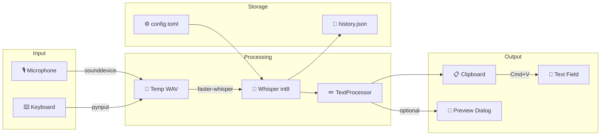

# TalkFlow - Architecture

## Overview

TalkFlow is a 100% local, privacy-focused voice-to-text dictation tool for macOS. It uses OpenAI's Whisper model (via faster-whisper) to transcribe speech and paste it at the cursor position in any application.

---

## 1. End-to-End Flow (Push-to-Talk)



---

## 2. Silence Auto-Stop Flow (Toggle Mode)



---

## 3. Text Processing Pipeline

```mermaid
flowchart LR
    A[Raw Whisper Text] --> B[Capitalization Commands]
    B --> C[Formatting Commands]
    C --> D[Punctuation Replacement]
    D --> E[Spacing Cleanup]
    E --> F[Final Text]

    subgraph B[Capitalization]
        B1["'all caps hello' → 'HELLO'"]
        B2["'capitalize world' → 'World'"]
    end

    subgraph C[Formatting]
        C1["'new line' → \\n"]
        C2["'new paragraph' → \\n\\n"]
    end

    subgraph D[Punctuation]
        D1["'period' → '.'"]
        D2["'comma' → ','"]
        D3["'question mark' → '?'"]
    end

    subgraph E[Cleanup]
        E1[Remove double spaces]
        E2[Capitalize after . ! ?]
        E3[Fix spacing around punct]
    end
```



---

## 4. Application Startup



---

## 5. Component Class Diagram



---

## 6. State Machine



---

## 7. Threading Model



---

## 8. Data Flow



---

## Technology Stack

| Layer | Technology | Purpose |
|-------|-----------|---------|
| Audio Capture | sounddevice + numpy | Real-time mic recording at 16kHz float32 |
| Audio Storage | scipy write_wav | float32 → int16 PCM WAV conversion |
| Speech-to-Text | faster-whisper (CTranslate2) | Local Whisper inference, int8 on CPU |
| Text Processing | regex | Spoken command → punctuation/formatting |
| Text Insertion | pynput + pyperclip | Clipboard paste via Cmd+V with save/restore |
| Hotkey Detection | pynput keyboard.Listener | Global keyboard monitoring |
| Menu Bar UI | rumps | macOS native menu bar app |
| Configuration | toml + dataclasses | Type-safe config with auto-migration |
| History | json | Last 50 transcriptions persisted |
| Sound Feedback | subprocess afplay | System sounds for states |
| Preview Dialog | osascript | Native macOS dialog for confirmation |

---

## File Structure

```
TalkFlow/
├── run.py                          # Entry point (PID, path setup)
├── config/
│   └── settings.toml               # Default config template
├── src/
│   ├── main.py                     # TalkFlowApp orchestrator + History
│   ├── core/
│   │   ├── audio_recorder.py       # Recording, silence detection, levels
│   │   ├── whisper_engine.py       # Transcription with 120s timeout
│   │   ├── text_inserter.py        # Clipboard paste with restore
│   │   ├── text_processor.py       # Spoken commands → punctuation
│   │   └── hotkey_manager.py       # Global hotkey + key normalization
│   ├── ui/
│   │   └── menu_bar.py             # rumps menu bar (state + controls)
│   └── utils/
│       └── config.py               # TOML config with dataclasses
├── scripts/
│   ├── install.sh                  # One-command setup
│   ├── start.sh / stop.sh          # Process management
│   ├── autostart.sh                # Login item management
│   └── check_permissions.py        # macOS permission helper
├── requirements.txt
├── ARCHITECTURE.md                 # This file
└── README.md
```

---

## Key Design Decisions

1. **Clipboard-only insertion** — Cmd+V ensures compatibility with all text fields including web apps with custom input handling.

2. **VAD disabled for short clips** — Silero VAD hangs on clips under 30s. Only enabled for longer recordings.

3. **Thread-per-transcription** — Each transcription runs in a daemon thread with a 120s timeout to prevent UI freezes.

4. **Max duration safety** — Configurable timer (default 300s) auto-stops to prevent resource exhaustion.

5. **Sound feedback** — System sounds (Tink/Pop/Glass/Basso) provide non-visual cues.

6. **Transcription history** — Last 50 transcriptions persisted for re-pasting.

7. **Race condition handling** — `_is_active` flag plus 500ms poll prevent double-start races.

8. **Clipboard restore** — Original clipboard saved before paste and restored after 350ms.

9. **Silence auto-stop** — Auto-stops after configured silence timeout, but only after speech has been detected first.

10. **Spoken command processing** — "period", "comma", "new line" etc. become actual punctuation/formatting.

11. **Preview before paste** — Optional native dialog shows text before pasting with 10s auto-dismiss.

---

## Spoken Commands Reference

| Say this | Gets replaced with |
|----------|-------------------|
| "period" / "full stop" | `.` |
| "comma" | `,` |
| "question mark" | `?` |
| "exclamation mark" | `!` |
| "colon" | `:` |
| "semicolon" | `;` |
| "dash" | `—` |
| "hyphen" | `-` |
| "ellipsis" | `...` |
| "new line" | line break |
| "new paragraph" | double line break |
| "tab" | tab character |
| "open quote" / "close quote" | `"` |
| "open paren" / "close paren" | `(` / `)` |
| "hashtag" / "hash" | `#` |
| "at sign" | `@` |
| "capitalize [word]" | Capitalizes next word |
| "all caps [word]" | UPPERCASES next word |
| "lowercase [word]" | lowercases next word |
