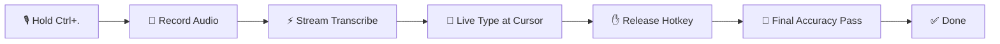
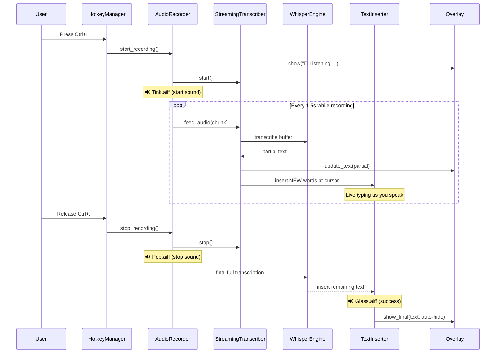
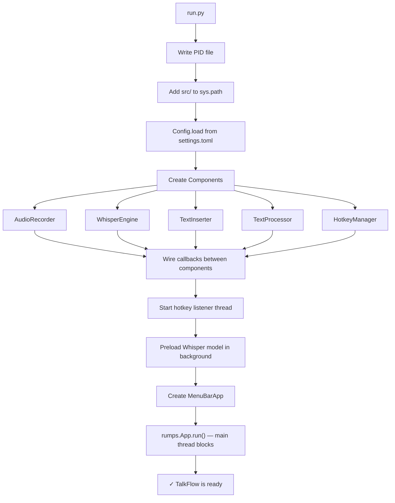
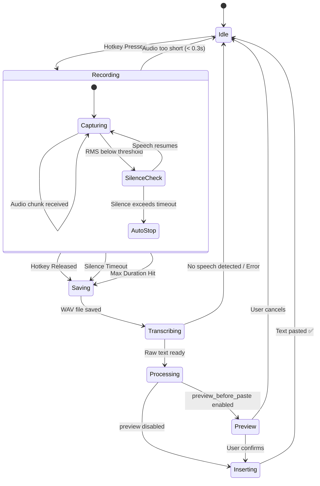
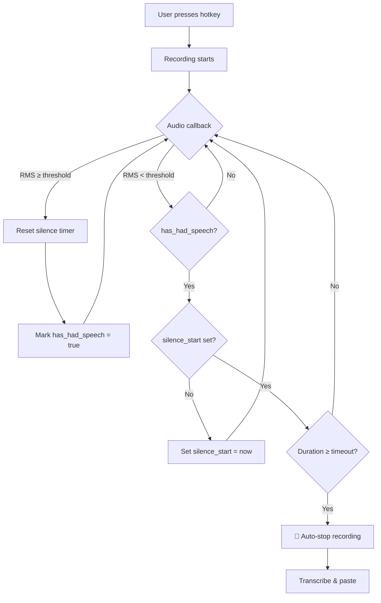
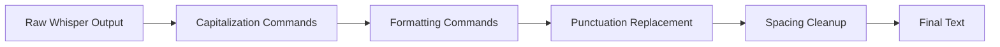
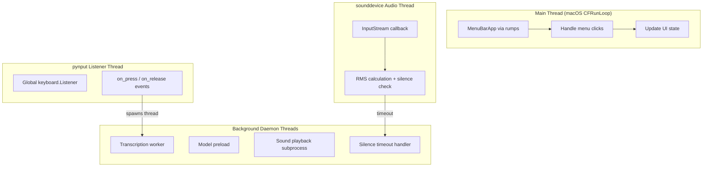
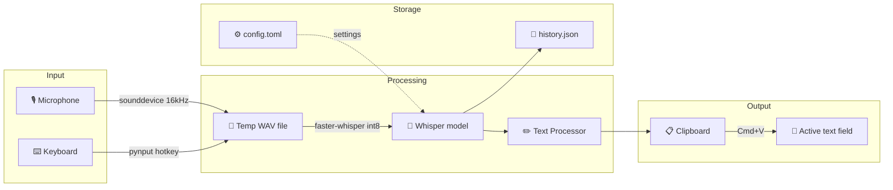
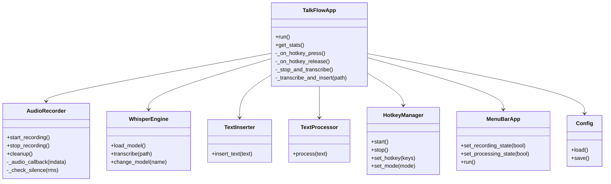

# TalkFlow

**Voice typing that runs 100% locally on your Mac using OpenAI's Whisper.**

Hold `Ctrl + .`, speak, release — your words appear at the cursor **in real-time as you speak**. In any app.

---

## How It Works

TalkFlow is a background macOS menu bar app that listens for a global hotkey, records your voice through the mic, and **streams transcription live** — text appears at your cursor as you speak, not after you stop. When you release the hotkey, a final accuracy pass fills in any remaining words.

There's no cloud, no API keys, no internet required. Everything runs on-device using `faster-whisper` with int8 quantization optimized for Apple Silicon.

### High-Level Flow



---

## Architecture & Workflow Diagrams

### 1. End-to-End Live Streaming Flow

This is the complete sequence from pressing the hotkey to text appearing live at your cursor:



### 2. Application Startup



### 3. State Machine



### 4. Toggle Mode & Silence Detection

In toggle mode, pressing the hotkey once starts recording, pressing again stops it. Silence auto-stop works in both modes:



### 5. Text Processing Pipeline

Spoken words like "period" and "new line" are converted to actual characters:



| Say this | Becomes |
|----------|---------|
| "period" / "full stop" | `.` |
| "comma" | `,` |
| "question mark" | `?` |
| "exclamation mark" | `!` |
| "new line" | line break |
| "new paragraph" | double line break |
| "capitalize hello" | `Hello` |
| "all caps world" | `WORLD` |

### 6. Threading Model



### 7. Data Flow



### 8. Component Architecture



---

## Features

- **🎙️ Live Speech-to-Text** — Text appears at your cursor as you speak, not after. Real-time streaming every 1.5 seconds.
- **🔒 100% Local** — All processing on your Mac. No cloud, no data leaves your device.
- **⚡ Fast** — Uses `faster-whisper` with int8 optimization for Apple Silicon.
- **🌍 Universal** — Works in any text field: browsers, editors, terminals, chat apps.
- **📊 Floating Overlay** — A live overlay shows what's being transcribed in real-time.
- **🎯 Smart Punctuation** — Say "period", "comma", "new line" and they become actual punctuation.
- **⌨️ Simple Hotkey** — One hotkey (`Ctrl + .`), no setup wizard, just works.
- **🔒 Private** — Only monitors `Ctrl + .`, nothing else. Audio deleted immediately.
- **📜 History** — Last 50 transcriptions saved; re-paste anytime from the menu bar.
- **🌐 Landing Page** — Beautiful website included for showcasing/deployment.

---

## Quick Start

```bash
cd TalkFlow
./scripts/install.sh
```

The install script will:
1. Create a Python virtual environment
2. Install all dependencies
3. Verify packages
4. Check macOS permissions
5. Optionally enable auto-start at login

Then grant permissions (see below) and start:

```bash
./scripts/start.sh
```

---

## Usage

```bash
# Start TalkFlow (uses venv automatically)
./scripts/start.sh

# Stop TalkFlow
./scripts/stop.sh
```

### Recording

1. Click into any text field
2. **Hold `Ctrl + .`** (Control + period)
3. Speak naturally — **text appears live at your cursor**
4. A floating overlay shows what's being transcribed
5. **Release** the keys — final accuracy pass completes
6. Done! Text is already there.

---

## Configuration

Edit `config/settings.toml` (or `~/.config/talkflow/config.toml`):

```toml
[whisper]
model = "base"            # tiny, base, small, medium, large-v3
language = "en"           # or "auto" for detection

[hotkey]
hotkey = "ctrl+."         # Change if needed
mode = "push_to_talk"     # push_to_talk or toggle

[audio]
max_duration = 300.0      # Max recording seconds (safety limit)
silence_timeout = 3.0     # Auto-stop after N seconds of silence
silence_threshold = 0.01  # RMS level for silence detection

[output]
process_commands = true           # Replace spoken punctuation
preview_before_paste = false      # Show confirmation dialog
add_trailing_space = true         # Space after transcribed text

[app]
play_sounds = true        # Audio feedback (start/stop/success sounds)
```

## Model Options

| Model | Speed | Accuracy | Size |
|-------|-------|----------|------|
| tiny | ~10x realtime | Basic | ~75 MB |
| **base** | ~7x realtime | Good | ~150 MB |
| small | ~4x realtime | Great | ~500 MB |
| medium | ~2x realtime | Excellent | ~1.5 GB |
| large-v3 | ~1x realtime | Best | ~3 GB |

---

## macOS Permissions (Required)

TalkFlow needs **three permissions** on the app you run it from (e.g., **Cursor.app**, **Terminal.app**, **Kiro.app**):

| Permission | Purpose |
|-----------|---------|
| **Accessibility** | Paste transcribed text at your cursor (Cmd+V) |
| **Input Monitoring** | Detect the `Ctrl + .` hotkey globally |
| **Microphone** | Capture audio from your Mac's microphone |

### How to grant

1. **System Settings → Privacy & Security → Accessibility** → add your terminal app
2. **System Settings → Privacy & Security → Input Monitoring** → add the same app
3. **System Settings → Privacy & Security → Microphone** → add the same app
4. **Quit and reopen** the terminal app (⌘+Q, then reopen)

Auto-detect your app:
```bash
python3 ./scripts/check_permissions.py
```

Full guide: [scripts/PERMISSIONS.md](scripts/PERMISSIONS.md)

---

## Auto-Start at Login

```bash
./scripts/autostart.sh install    # Enable
./scripts/autostart.sh uninstall  # Disable
./scripts/autostart.sh status     # Check
```

---

## Technology Stack

| Layer | Technology | Purpose |
|-------|-----------|---------|
| Audio Capture | sounddevice + numpy | Real-time mic recording at 16kHz |
| Speech-to-Text | faster-whisper (CTranslate2) | Local Whisper inference, int8 on CPU |
| Streaming | StreamingTranscriber | Chunks audio every 1.5s for live transcription |
| Text Processing | regex | Spoken commands → punctuation/formatting |
| Text Insertion | pynput + pyperclip | Clipboard paste via Cmd+V |
| Hotkey Detection | pynput keyboard.Listener | Global keyboard monitoring |
| Menu Bar UI | rumps | macOS native menu bar app |
| Live Overlay | AppKit / PyObjC | Floating window showing real-time transcription |
| Configuration | toml + dataclasses | Type-safe settings |
| Landing Page | Next.js + Tailwind + Framer Motion | Vercel-deployable website |

---

## Project Structure

```
TalkFlow/
├── run.py                          # Entry point
├── config/
│   └── settings.toml               # Default configuration
├── src/
│   ├── main.py                     # TalkFlowApp orchestrator + History
│   ├── core/
│   │   ├── audio_recorder.py       # Recording, silence detection
│   │   ├── whisper_engine.py       # Transcription engine
│   │   ├── text_inserter.py        # Clipboard paste with restore
│   │   ├── text_processor.py       # Spoken commands → punctuation
│   │   ├── hotkey_manager.py       # Global hotkey listener
│   │   └── streaming_transcriber.py # Real-time streaming transcription
│   ├── ui/
│   │   ├── menu_bar.py             # rumps menu bar app
│   │   └── overlay.py              # Floating transcription overlay (AppKit)
│   └── utils/
│       └── config.py               # TOML config with dataclasses
├── website/                        # Next.js landing page (deployable to Vercel)
│   ├── src/
│   │   ├── app/                    # Next.js app router
│   │   └── components/             # React components (Hero, Features, Demo, etc.)
│   ├── package.json
│   └── next.config.ts
├── scripts/
│   ├── install.sh                  # One-command setup
│   ├── start.sh / stop.sh          # Process management
│   ├── autostart.sh                # Login item management
│   └── check_permissions.py        # macOS permission helper
├── diagrams/                       # Architecture diagrams (PNG + Mermaid)
├── requirements.txt
├── ARCHITECTURE.md                 # Detailed architecture reference
└── README.md                       # This file
```

---

## Troubleshooting

| Problem | Solution |
|---------|----------|
| Hotkey not working | Grant **Input Monitoring** to your terminal app, then restart it |
| Text not inserting | Grant **Accessibility** to the same app, restart |
| No audio captured | Grant **Microphone** permission to the terminal app |
| Wrong language | Set `language = "en"` in config |
| "This process is not trusted" | Add **Cursor.app** / **Kiro.app** / **Terminal.app** (not `/bin/sh`) |
| Live typing not appearing | Whisper model still loading — wait for "Model ready!" in logs |
| `bad escape` error | Fixed in latest version — update `text_processor.py` |

---

## Privacy

- All audio processed locally using faster-whisper
- No network calls, no telemetry, no analytics
- Audio is deleted immediately after transcription
- Only `Ctrl + .` hotkey is monitored

## Website

TalkFlow includes a landing page built with **Next.js**, **Tailwind CSS**, and **Framer Motion** — ready to deploy on Vercel.

```bash
cd website
npm install
npm run dev      # Preview locally at http://localhost:3000
```

Deploy to Vercel:
```bash
cd website
npx vercel
```

Or connect the repo on [vercel.com](https://vercel.com) with **Root Directory** set to `website`.

---

## Requirements

- macOS 13.0+ (Ventura or later)
- Python 3.9+
- ~500 MB disk space (with base model)
- ~2 GB RAM while running

## License

MIT
